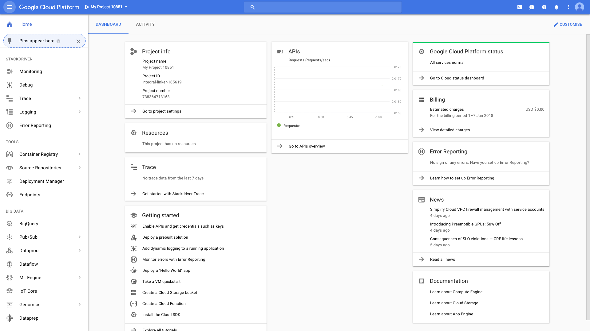
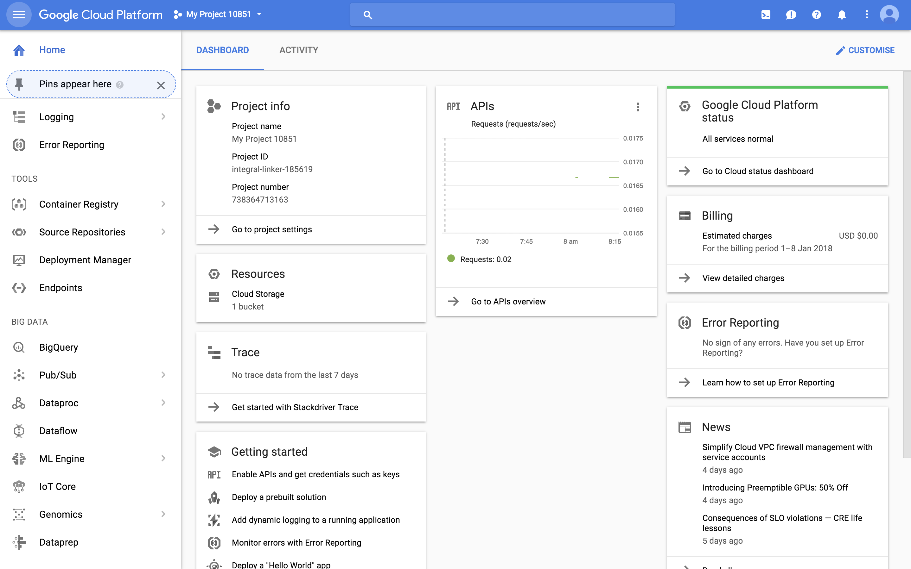
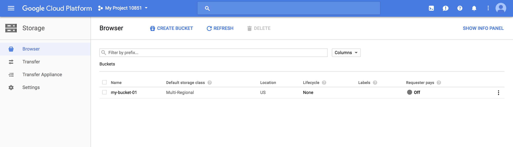
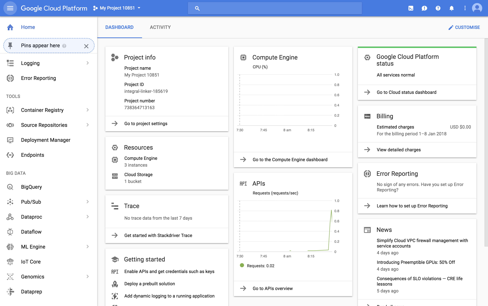
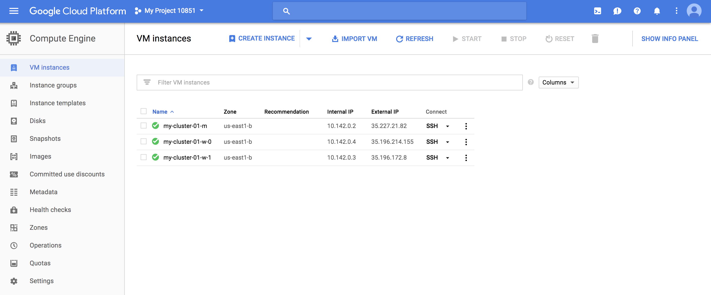
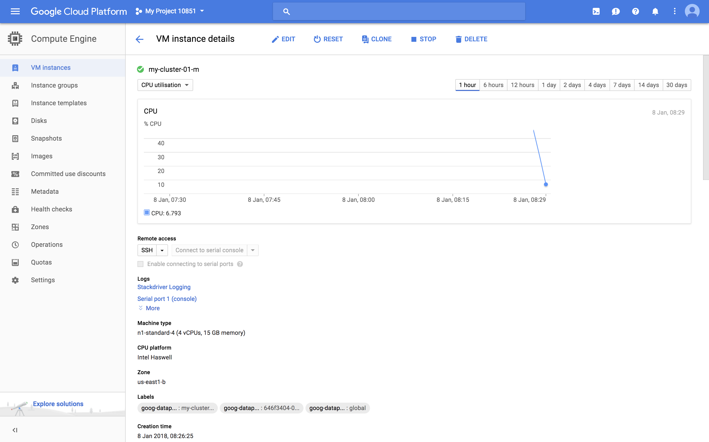

**ST446 Distributed Computing for Big Data**

This is the main activity for the first week.

# Google Cloud Platform

In this class, we are going to learn how to set up Google Cloud Platform (GCP) and perform some simple tasks.
Please make sure that you get everything to work, as we will use GCP at various points during the course.

First, we will look at some basic commands to use the GCP.
Then, we will set up a dataproc cluster.
Finally, we will learn how to run a jupyter notebook on the cluster.

## 1. Preparation
In this section we will look into setting up a remote cluster using the Google Cloud Platform.
Similar functionality is also available through other Infrastructure-as-a-Service providers, such as [Amazon Web Services](https://aws.amazon.com/free/), [Databricks Community Edition](../../instructions/databricks_spark.md) and [Microsoft Azure](../../instructions/azure-hdinsight.md).

GCP can be accessed via the Google Cloud Console and the Google Cloud SDK. Please make sure you can access the Google Cloud Console and install the Google Cloud SDK on your computer.

### Google Cloud Console
Google Cloud Console is a web user-interface for GCP, for configuring and using various services and monitoring usage activity.
You can access Google Cloud Console [here](https://console.cloud.google.com)



### Google Cloud SDK
Google Cloud SDK (Software Development Kit) is a command line tool that allows you to manage resources and services hosted on GCP.
For example, you may list, copy, remove files using `gsutil ls`, `gsutil cp`, `gsutil rm`, respectively.
Please check out this more detailed [overview](https://cloud.google.com/sdk/docs/overview).

You need to install Google Cloud SDK before using it. Please follow the [installation instructions](https://cloud.google.com/sdk/docs/quickstarts). Once you have installed it (and your google cloud account is set up), make sure to run the provided examples to check that your installation is running as it should be.

(You might need to use Python 2.7 to install Google Cloud SDK on your computer. In Anaconda, you can set up an environment for this, through `conda create -n py27 python=2.7 anaconda`, without uninstalling other versions of python. Anaconda will let you switch between environments.)

Once Google Cloud SDK is installed, you can get basic information about your configuration using the terminal/command line command:
```
gcloud config list
```
Note: You will need to be in either in the folder where gcloud resides or have the directory path where gcloud is located added to PATH environment variable.

Example output:
```
LSE021353:~ vojnovic$ gcloud config list
[core]
account = milanvojnov@gmail.com
disable_usage_reporting = True
project = integral-linker-185619

Your active configuration is: [default]
```

## 2. Upload and download files into GCP

A bucket works very similarly to a regular directory/folder on your computer.

In order to upload and download files, we first need to create a bucket and then upload and download the files to/from the bucket.
This can be done using either Google Cloud Console or Google Cloud SDK.
We provide you with resources on how to do it in Google Cloud Console and provide you with the code for Google Cloud SDK.

### Google Cloud Console approach:

* Create bucket: https://cloud.google.com/storage/docs/creating-buckets
* Upload, download and delete a file: https://cloud.google.com/storage/docs/object-basics

### Google Cloud SDK approach:
All the commands are very similar to the usual commands you use in a command line interface of your Mac/Linux computer.

For Windows system, once you have installed Google Cloud SDK, a 'Google Cloud SDK shell' will appear on desktop or start menu.
Use this one instead of Powershell or command line prompt.

* See what buckets you have:

```
gsutil ls
```
* Create a bucket (change `my-bucket` to your own bucket name):

```
gsutil mb gs://my-bucket/
```
Example:
```
LSE021353:~ vojnovic$ gsutil mb gs://my-bucket-01/
Creating gs://my-bucket-01/...
```
See [here](https://cloud.google.com/storage/docs/gsutil/commands/mb) for more on creating buckets.

Once your bucket is created, you should be able to see it in the Google Cloud Console:



Here are some details about the created bucket:




* Upload a file:
You can get the helloworld.py [here](helloworld.py)
```
gsutil cp helloworld.py gs://my-bucket
```

Example:
```
LSE021353:files vojnovic$ gsutil cp helloworld.py gs://my-bucket-01
Copying file://helloworld.py [Content-Type=text/x-python]...
\ [1 files][  147.0 B/  147.0 B]                                                
Operation completed over 1 objects/147.0 B.                    
```

You can check if your file has been uploaded by checking what's inside your bucket:
```
gsutil ls gs://my-bucket
```

Example:
```
LSE021353:files vojnovic$ gsutil ls gs://my-bucket-01
gs://my-bucket-01/helloworld.py
```

* Download a file:

```
gsutil cp gs://my-bucket/helloworld.py Desktop
```
* Remove a file:

```
gsutil rm gs://my-bucket/helloworld.py
```
**(You may not want to do this until the end of the exercise.)**

* Remove the whole bucket:

```
gsutil rm -r gs://my-bucket
```
**(You may not want to do this until the end of the exercise.)**

Example:

```
LSE021353:files vojnovic$ gsutil rm -r gs://my-bucket-01
Removing gs://my-bucket-01/helloworld.py#1515399609789091...
Removing gs://my-bucket-01/google-cloud-dataproc-metainfo/646f3404-0769-4f92-9809-333074bbb661/cluster.properties#1515399984493936...
Removing gs://my-bucket-01/google-cloud-dataproc-metainfo/646f3404-0769-4f92-9809-333074bbb661/my-cluster-01-m/dataproc-initialization-script-0_output#1515400127345120...
Removing gs://my-bucket-01/google-cloud-dataproc-metainfo/646f3404-0769-4f92-9809-333074bbb661/my-cluster-01-m/dataproc-startup-script_output#1515400044457041...
/ [4 objects]                                                                   
==> NOTE: You are performing a sequence of gsutil operations that may
run significantly faster if you instead use gsutil -m -o ... Please
see the -m section under "gsutil help options" for further information
about when gsutil -m can be advantageous.

Removing gs://my-bucket-01/google-cloud-dataproc-metainfo/646f3404-0769-4f92-9809-333074bbb661/my-cluster-01-w-0/dataproc-initialization-script-0_output#1515400027778604...
Removing gs://my-bucket-01/google-cloud-dataproc-metainfo/646f3404-0769-4f92-9809-333074bbb661/my-cluster-01-w-0/dataproc-startup-script_output#1515400015951859...
Removing gs://my-bucket-01/google-cloud-dataproc-metainfo/646f3404-0769-4f92-9809-333074bbb661/my-cluster-01-w-1/dataproc-initialization-script-0_output#1515400029415869...
Removing gs://my-bucket-01/google-cloud-dataproc-metainfo/646f3404-0769-4f92-9809-333074bbb661/my-cluster-01-w-1/dataproc-startup-script_output#1515400015954649...
/ [8 objects]                                                                   
Operation completed over 8 objects.                                              
Removing gs://my-bucket-01/...

```


Reference: https://cloud.google.com/storage/docs/quickstart-gsutil


## 3. Running jobs on a Google Cloud dataproc cluster
In this section, we set up a new dataproc cluster, run some pyspark code, and delete the cluster.

Google Cloud Dataproc is a managed Apache Spark and Apache Hadoop service. It allows you to run Apache Spark and Apache Hadoop clusters on GCP. You may find more information [in the documentation](https://cloud.google.com/dataproc/docs/).

In the following, we show you how to set up a cluster on Google Cloud Dataproc and run a Pyspark job on this cluster.
You can also create a cluster via Google Cloud Console. You should be able to do this yourself by following the references at the end of this document.

First of all, set the default region of dataproc cluster

```
gcloud config set dataproc/region <regionid>
```

here we replace `<regionid>` with `europe-west2` to use the clusters located in London.

Example:

```
(base) LSE021353-2:~ st446$ gcloud config set dataproc/region europe-west2
Updated property [dataproc/region].
```

### 3a. Create and delete a Google Cloud dataproc cluster

1\. Create cluster

Use the following command to set up a cluster.

```
gcloud dataproc clusters create <clustername> --project <projectid> --bucket <bucketname>
```

You should set `<projectid>` to your own `projectid` and `<bucket id>` to the ones you created in Section 2. You can choose your own `<clustername>`.

Example:

```
(base) LSE021353-2:~ st446$ gcloud dataproc clusters create jialin-cluster --project st446-lent --bucket jialin-bucket
Waiting on operation [projects/st446-lent/regions/europe-west2/operations/d83d5f31-e3a0-3a9b-ba0b-e149cdd09036].
Waiting for cluster creation operation...                                      
WARNING: For PD-Standard without local SSDs, we strongly recommend provisioning 1TB or larger to ensure consistently high I/O performance. See https://cloud.google.com/compute/docs/disks/performance for information on disk I/O performance.
Waiting for cluster creation operation...done.                                 
Created [https://dataproc.googleapis.com/v1/projects/st446-lent/regions/europe-west2/clusters/jialin-cluster] Cluster placed in zone [europe-west2-a].
```

If you encouter warnings like

```
API [dataproc.googleapis.com] not enabled on project [1058816542491]. 
Would you like to enable and retry (this will take a few minutes)? 
(y/N)?
```
type `y` to accept the installation of DataProc APIs


Again, once the cluster is created, you can see it in the Google Cloud Console:



Here are some details about the cluster nodes:



Here are some further details about the master node:




### 3b. Submit a job

Once you have your cluster ready, you can submit your job using `job submit` command. Here we submit a simple hello world PySpark job.

```
gcloud dataproc jobs submit pyspark --cluster <clustername> gs://my-bucket/helloworld.py
```

(Don't worry about the details yet, we will re-visit `helloworld.py`.)


### 3c. Delete a cluster

You may delete you cluster as follows. Once you have deleted your cluster, make sure also to delete your bucket, so that we don't waste our allocated credit.

```
gcloud dataproc clusters delete <clustername>
```

Example:

```
(base) LSE021353-2:~ st446$ gcloud dataproc clusters delete jialin-cluster
The cluster 'jialin-cluster' and all attached disks will be deleted.

Do you want to continue (Y/n)?  y

Waiting on operation [projects/st446-lent/regions/europe-west2/operations/ea252d8a-9643-31f4-a5a5-7a3aafc41b84].
Waiting for cluster deletion operation...done.                                 
Deleted [https://dataproc.googleapis.com/v1/projects/st446-lent/regions/europe-west2/clusters/jialin-cluster].
```

Delete the bucket using

```
gsutil rm -r gs://<bucket_name>
```

### 4. Running Jupyter notebooks on Google Cloud Dataproc clusters 

In this section, we will set up a dataproc cluster for PySpark and connect it to a Jupyter notebook.
Please try to get it to run by next week.

The following instructions worked on MacOS with Chrome: [Section: Create a cluster and install the Jupyter component](https://cloud.google.com/dataproc/docs/tutorials/jupyter-notebook). You can also find the steps for 
Windows and Linux.

If you have difficulties setting it up, please get in contact with the teaching assistant.

#### 4a. Create a cluster on which to run Jupyter notebook

Refer to [this document](../instructions/jupyter-dataproc.md) to create a Dataproc cluster through the Google Cloud Console.

Use the following command to create a Dataproc cluster with Jupyter notebook:

```
gcloud beta dataproc clusters create cluster-name \
    --optional-components=ANACONDA,JUPYTER \
    --image-version=1.3 \
    --enable-component-gateway \
    --bucket <bucket-name> \
    --project <project-id>
```

If you see the warnings on installing the `gcloud beta`, type `y` to accept it.

Examples:

```
(base) LSE021353-2:~ st446$ gcloud beta dataproc clusters create jialin-cluster --optional-components=ANACONDA,JUPYTER     --image-version=1.3     --enable-component-gateway  --bucket jialin-bucket --project st446-lent
Waiting on operation [projects/st446-lent/regions/europe-west2/operations/140e0f00-f4e0-3d88-aeef-188a5c36ab52].
Waiting for cluster creation operation...                                      
WARNING: For PD-Standard without local SSDs, we strongly recommend provisioning 1TB or larger to ensure consistently high I/O performance. See https://cloud.google.com/compute/docs/disks/performance for information on disk I/O performance.
Waiting for cluster creation operation...done.                                 
Created [https://dataproc.googleapis.com/v1beta2/projects/st446-lent/regions/europe-west2/clusters/jialin-cluster] Cluster placed in zone [europe-west2-a].
```

#### 4b. Open the Jupyter notebook in your local browser

Navigate to the Dataproc [Clusters](https://console.cloud.google.com/dataproc/clusters?_ga=2.858289.-1894457944.1576246827) form on Google Cloud Console, then select your cluster to open the **Cluster details** form. Click the **Web Interfaces** tab to display a list of Component Gateway links to the web interfaces of [default and optional components](https://cloud.google.com/dataproc/docs/concepts/components/overview) installed on the cluster.


Click the **Jupyter** link. The Jupyter notebook web UI opens in your local browser.


### References

If you have any difficulties in running the codes above, you can have a look of the following links:

* Tutorial: https://cloud.google.com/dataproc/docs/tutorials/jupyter-notebook
* https://cloud.google.com/blog/big-data/2017/02/google-cloud-platform-for-data-scientists-using-jupyter-notebooks-with-apache-spark-on-google-cloud
* FAQ: https://cloud.google.com/dataproc/docs/resources/faq)
* Create cluster: https://cloud.google.com/dataproc/docs/guides/create-cluster
* Submit jobs: https://cloud.google.com/dataproc/docs/guides/submit-job
* Using the Python Client Library: https://cloud.google.com/dataproc/docs/tutorials/python-library-example
* Initialization actions: https://cloud.google.com/dataproc/docs/concepts/configuring-clusters/init-actions and https://github.com/GoogleCloudPlatform/dataproc-initialization-actions
