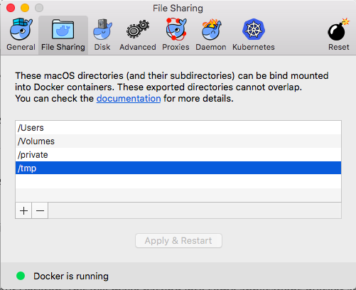

**ST446 Distributed Computing for Big Data**

# Docker

Docker is a software designed to make it easier to create, deploy, and run applications by using containers.
The reason we introduce it here is because you may need to run Spark, Hadoop or other software without installing it in your system (though we encourage you to make these installations).
In case if you run into difficulties when trying to install any of the needed software on your computer, you may use docker as a backup plan.

## Install docker
* Mac: https://docs.docker.com/docker-for-mac/install/
* Windows: https://docs.docker.com/docker-for-windows/install/
* Older Mac and Windows systems that do not meet the requirements to install the Docker for Mac / Windows: https://docs.docker.com/toolbox/toolbox_install_windows/

(If docker uses too much space on your Mac, use the Edge instead of the Stable version of Docker. See [here](https://github.com/docker/for-mac/issues/371) for more details.)

## Running Pyspark on docker

Here we use a docker container to run PySpark notebooks. Make sure you have `jupyter notebook` and the python package `pyspark`. See [here](https://github.com/lse-st446/lectures/blob/master/supplementary/install_jupyter_notebook.md) for more details

### 1. Run:
```
docker run -p 8888:8888 -v $PWD:/home/jovyan/work --name spark jupyter/pyspark-notebook
```
This mounts directory `/home/jovyan/work` to directory `$PWD` in your local file system. You need to make sure that $PWD is contained in a directory shared in your docker configuration:

Example:

(the `$PWD` is inside the `Volume/`)




```
Loks-MacBook-Air:docker Christine$ docker run -p 8888:8888 -v $PWD:/home/jovyan/work --name spark jupyter/pyspark-notebook
Executing the command: jupyter notebook
[I 14:31:11.205 NotebookApp] Writing notebook server cookie secret to /home/jovyan/.local/share/jupyter/runtime/notebook_cookie_secret
[W 14:31:15.355 NotebookApp] WARNING: The notebook server is listening on all IP addresses and not using encryption. This is not recommended.
[I 14:31:15.541 NotebookApp] JupyterLab alpha preview extension loaded from /opt/conda/lib/python3.6/site-packages/jupyterlab
[I 14:31:15.542 NotebookApp] JupyterLab application directory is /opt/conda/share/jupyter/lab
[I 14:31:16.276 NotebookApp] Serving notebooks from local directory: /home/jovyan
[I 14:31:16.276 NotebookApp] 0 active kernels
[I 14:31:16.276 NotebookApp] The Jupyter Notebook is running at:
[I 14:31:16.276 NotebookApp] http://[all ip addresses on your system]:8888/?token=38809782dc896dc48ecca3a71645a5e4d04bc5555f0d263e
[I 14:31:16.276 NotebookApp] Use Control-C to stop this server and shut down all kernels (twice to skip confirmation).
[C 14:31:16.277 NotebookApp]

    Copy/paste this URL into your browser when you connect for the first time,
    to login with a token:
        http://localhost:8888/?token=38809782dc896dc48ecca3a71645a5e4d04bc5555f0d263e
```
### 2. Open Jupyter

Copy and paste the output from item 1 (something like this `http://localhost:8888/?token=38809782dc896dc48ecca3a71645a5e4d04bc5555f0d263e`) into your browser, which will open Jupyter. Open a new Python notebook.

### 3. (For first time) Check your installation

Copy the following code to a cell in the Python notebook that you openned and run it:

```python
   import pyspark
   sc = pyspark.SparkContext('local[*]')

   # do something to prove it works
   rdd = sc.parallelize(range(1000))
   rdd.takeSample(False, 5)
```
If it runs correctly you will get output that looks similar to this `[998, 350, 582, 576, 648]`.

## References

* http://maxmelnick.com/2016/06/04/spark-docker.html
* https://github.com/jupyter/docker-stacks/tree/master/pyspark-notebook
