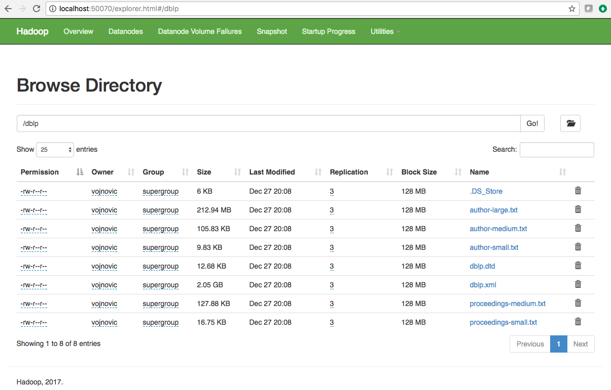

# 0. Preparation: Hadoop installation and configuration

The instructions provided below here are for Hadoop 2.x installation on Mac OS Sierra (10.12.x). Installation on other systems may require some modifications, which you should be able to make by finding relevant information on the web. Here is some references may be useful for you:

* You can download hadoop from here: http://www.apache.org/dyn/closer.cgi/hadoop/common/
* For Windows users: 
* [How to install Apache Hadoop on windows 10](https://www.datasciencecentral.com/profiles/blogs/how-to-install-and-run-hadoop-on-windows-for-beginners). 
* [Hadoop 2 on Windows](https://wiki.apache.org/hadoop/Hadoop2OnWindows)

We also encourage you to collaborate with your peers (for example, with your peers using a Windows system, if you use a laptop running a Windows operating system). We also encourage you to make a record of any different steps you needed to make in order to get your installation working in your designated GitHub repo, so we can share knowledge.

## 0.A. Hadoop installation

Here we use `home brew` to install Hadoop. Check if `home brew` is installed or not by running the following command: `brew -v`. If you do not have `home brew` installed, install it from [http://brew.sh](http://brew.sh).

You can install Hadoop using `brew` by running the following two commands:
   * `brew search hadoop`
   * `brew install hadoop`

Example:
```
LSE021353:~ vojnovic$ brew search hadoop
==> Searching local taps...
hadoop
==> Searching taps on GitHub...
==> Searching blacklisted, migrated and deleted formulae...
LSE021353:~ vojnovic$ brew install hadoop
Updating Homebrew...
==> Auto-updated Homebrew!
[deletia]
==> Downloading https://www.apache.org/dyn/closer.cgi?path=hadoop/common/hadoop-2.8.2/hadoop-
==> Best Mirror http://apache.mirror.anlx.net/hadoop/common/hadoop-2.8.2/hadoop-2.8.2.tar.gz
######################################################################## 100.0%
==> Caveats
In Hadoop's config file:
  /usr/local/opt/hadoop/libexec/etc/hadoop/hadoop-env.sh,
  /usr/local/opt/hadoop/libexec/etc/hadoop/mapred-env.sh and
  /usr/local/opt/hadoop/libexec/etc/hadoop/yarn-env.sh
$JAVA_HOME has been set to be the output of:
  /usr/libexec/java_home
==> Summary
🍺  /usr/local/Cellar/hadoop/2.8.2: 21,056 files, 618MB, built in 2 minutes 12 seconds
```

Hadoop is installed in the directory: `/usr/local/Cellar/hadoop` (as shown in the last line of the output)

## 0.B. Hadoop configuration

The following configuration files need to be modified:

* hadoop-env.sh
* core-site.xml
* mapred-site.xml
* hdfs-site.xml

In our example, these files are located at `/usr/local/Cellar/hadoop/2.8.2/libexec/etc/hadoop/`. The path in your computer maybe different (e.g. you may use another version of Hadoop so your path may not contain `2.8.2`).

If you are not able to find some of the files but you can see a template file with the corresponding name (e.g. you have `mapred-site.xml.template` but not `mapred-site.xml`), you can copy the template file and rename it to the file name that you need (e.g. use the command `cp mapred-site.xml.template mapred-site.xml`).

### 0.B.1. hadoop-env.sh

Change `$HADOOP_OPTS -Djava.net.preferIPv4Stack=true`

to

`$HADOOP_OPTS -Djava.net.preferIPv4Stack=true -Djava.security.krb5.realm=-Djava.security.krb5.kdc`

### 0.B.2. core-site.xml

Add the following *within* the xml configuration element:

```
<property>
    <name>hadoop.tmp.dir</name>
    <value>/usr/local/Cellar/hadoop/hdfs/tmp</value>
    <description>A base for other temporary directories</description>
</property>

<property>
    <name>fs.default.name</name>
    <value>hdfs://localhost:9000</value>
</property>
```

### 0.B.3. mapred-site.xml

Add the following *within* the xml configuration element:

```
<property>
    <name>mapred.job.tracker</name>
    <value>localhost:9010</value>
</property>
```

### 0.B.4. hdfs-site.xml

Add the following *within* the xml configuration element:

```
<property>
    <name>dfs.replication</name>
    <value></value>
</property>
```

This allows you to set the replication factor for HDFS file blocks. The default value is 3. As you will run this class exercises on a single node (your laptop), the actual replication factor will be 1.


## 0.C. Enabling SSH

1. Check whether the following files exist `~/.ssh/id_rsa` and `~/.ssh/id_rsa.pub`

    If these two file do not exist, then use `ssh-keygen` to generated them, e.g. by running `ssh-keygen -t rsa`

2. Enable remote login [System Preferences -> Sharing, and then check "Remote login"]

    

3. Authorize the SSH keys: `cat ~/.ssh/id_rsa.pub >> ~/.ssh/authorized_keys`

## 0.D. Create aliases to start and stop Hadoop deamons

Edit `~/.bash_profile` (or something similar) by adding:

* `alias hstart='/usr/local/Cellar/hadoop/2.8.2/sbin/start-all.sh'`
* `alias hstop='/usr/local/Cellar/hadoop/2.8.2/sbin/stop-all.sh'`

This will create a shortcut for you to start and stop Hadoop deamons.

Add also

```
export HADOOP_HOME=/usr/local/Cellar/hadoop/2.8.2
export PATH=$HADOOP_HOME/bin:$PATH
```
Run: `source ~/.bash_profile` or close and reopen the terminal window so that these changes will be effective when you run the commands below.

## 0.E. Format the HDFS

Run: `hdfs namenode -format`

Your hadoop should be installed properly and it should be ready to use.

## 0.F. Start and stop Hadoop daemons

### 0.F.1 Start Hadoop daemons
Run: `hstart`

```
LSE021353:~ vojnovic$ hstart
This script is Deprecated. Instead use start-dfs.sh and start-yarn.sh
17/12/27 19:20:32 WARN util.NativeCodeLoader: Unable to load native-hadoop library for your platform... using builtin-java classes where applicable
Starting namenodes on [localhost]
localhost: starting namenode, logging to /usr/local/Cellar/hadoop/2.8.2/libexec/logs/hadoop-vojnovic-namenode-LSE021353.local.out
localhost: starting datanode, logging to /usr/local/Cellar/hadoop/2.8.2/libexec/logs/hadoop-vojnovic-datanode-LSE021353.local.out
Starting secondary namenodes [0.0.0.0]
The authenticity of host '0.0.0.0 (0.0.0.0)' can't be established.
ECDSA key fingerprint is SHA256:6fSoDQKgx3bl6d1qWA3oSxXo+BF/xMCXX5bQyaAIWYU.
Are you sure you want to continue connecting (yes/no)? yes
0.0.0.0: Warning: Permanently added '0.0.0.0' (ECDSA) to the list of known hosts.
0.0.0.0: starting secondarynamenode, logging to /usr/local/Cellar/hadoop/2.8.2/libexec/logs/hadoop-vojnovic-secondarynamenode-LSE021353.local.out
17/12/27 19:20:58 WARN util.NativeCodeLoader: Unable to load native-hadoop library for your platform... using builtin-java classes where applicable
starting yarn daemons
starting resourcemanager, logging to /usr/local/Cellar/hadoop/2.8.2/libexec/logs/yarn-vojnovic-resourcemanager-LSE021353.local.out
localhost: starting nodemanager, logging to /usr/local/Cellar/hadoop/2.8.2/libexec/logs/yarn-vojnovic-nodemanager-LSE021353.local.out
```

You can ignore the warning `WARN util.NativeCodeLoader: Unable to load native-hadoop library for your platform... using builtin-java classes where applicable
Starting namenodes on [localhost]`.

Running a job tracking deamon:

```
LSE021353:~ vojnovic$ $HADOOP_HOME/sbin/mr-jobhistory-daemon.sh start historyserver
starting historyserver, logging to /usr/local/Cellar/hadoop/2.8.2/libexec/logs/mapred-vojnovic-historyserver-LSE021353.out
```


### 0.F.2. Check all the Hadoop daemons

Run: `jps`

```
LSE021353:~ vojnovic$ jps
36497 DataNode
36721 ResourceManager
36853 Jps
36412 NameNode
36604 SecondaryNameNode
36813 NodeManager
28670 SparkSubmit
```
You should make sure you have the DataNode. If you cannot find it, take a look here: https://stackoverflow.com/questions/10097246/no-data-nodes-are-started

For NameNode Web UI: [http://localhost:50070](http://localhost:50070)



For YARN Web UI: [http://localhost:8088](http://localhost:8088)

### 0.F.3. Stop Hadoop daemons

Run: `hstop`

Note: don't run this while your perform this exercise (you need Hadoop daemons up and running).

**References**:
* [Install Apache Hadoop on Mac OS Sierra](https://www.slideshare.net/SunilkumarMohanty3/install-apache-hadoop-on-mac-os-sierra-76275019)
* [Hadoop: Setting up a Single Node Cluster](https://hadoop.apache.org/docs/stable/hadoop-project-dist/hadoop-common/SingleCluster.html)
* [Hadoop in OSX El-Capitan](https://dtflaneur.wordpress.com/2015/10/02/installing-hadoop-on-mac-osx-el-capitan/)
