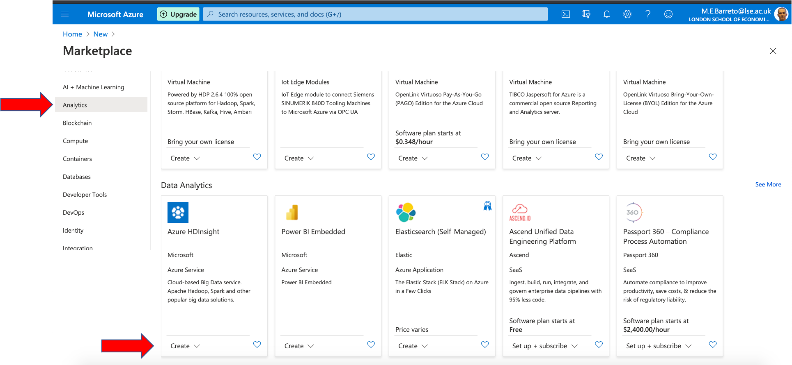

**ST446 Distributed Computing for Big Data**

Follow these steps to register for a free account at Microsoft Azure. You will have:

* GBP 150.00 credit valid for 30 days,
* 12 month access to popular services (compute, storage, databases and AI models), and 
* access to 25+ services always free. 

# Registration for Microsoft Azure

Refer to the [Azure free account](https://azure.microsoft.com/en-gb/free/) Website, click on **Start for Free** and fill out your information.

Once you have registered, go to your **Portal** dashboard and do a quick tour to get yourself familiarized with the environment. 

You can check the links below for further reference on how to use and customize your Azure portal:

* [Azure portal overview](https://docs.microsoft.com/en-us/azure/azure-portal/azure-portal-overview)
* [Azure portal documentation](https://docs.microsoft.com/en-us/azure/azure-portal/)

# Basic concepts and experimentation

## Resource Group creation

One important abstraction inside Azure is the **Resource Group**, which is a logical way of grouping data and services you are using in your workspace to run a give application.

You need to create a resource group before creating any other resource (e.g. cluster or virtual machine). In your **Portal**, click on **Resource Groups** and then on **Add** to open a creation form. Make sure you are using the Free Trial subscription (this should appear automatically). Provide a name and a region for your resource group. In my example, I have used *(Europe) UK South* to minimize latency. Click on **Review + Create**.

## (OPTIONAL) Virtual machine creation

Virtual machine creation in Azure usually takes a long time (20-30 minutes) to complete. If you are not interested in this topic, go directly to **HDInsight cluster creation** and follow the instructions there.

You can now create a virtual machine for experimentation. Back to your **Portal**, click on **Virtual Machines** and then on **Add** to open a creation form. 

Your Free Trial subscription should appear again. Pick the resource group you created in the last step and use the same region for your virtual machine. You should provide a name and choose one image from the list of Linux and Windows OS images available. Depending on your choice, you will have a set of different **sizes** of virtual machines to choose from. For experimentation purposes, you can choose any *Standard 1 vcpu* image.

You should also provide an username and password to connect to your virtual machine or use an SSH key. Have a look on the links below for some guidance on how to use SSH keys to connect to virtual machines in Azure. 

* [SSH keys with Windows on Azure](https://docs.microsoft.com/en-us/azure/virtual-machines/linux/ssh-from-windows)
* [SSH to your Azure Linux VMs](https://joelatwar.medium.com/how-to-ssh-to-your-azure-linux-vms-with-username-and-password-from-windows-linux-or-mac-df7d07ea3be1)
* [Microsoft Github Tips and Tricks](https://microsoft.github.io/AzureTipsAndTricks/blog/tip10.html)

You can go through the remaining items (Disks, Networking etc) to check which configuration and options are available, but you do not need to change anything. Then, you can **Review + Create** your virtual machine. **This process will take 20-30 minutes to complete**, so make sure your configuration is correct!

# Creating an HDInsight cluster and running Spark jobs

To create an HDInsight cluster, click on **Analytics** (left panel), then **See all**, and then search for *Azure HDInsight*.

You need to check if your Free Trial registration is registered to use HDInsight. By default, it is not. To enable the use of HDInsight, click on **Click here to register**. 

This will lead you to the Free Trial Resource Providers page. Search for *HDInsight*, click on **Register** and wait for the registration to the service. You will see a message "Deployment is in progress". This will take some minutes! 

If the page freezes while showing the “Registering…” message, you can refresh the page or click on **Resource Providers** (left panel) to check whether your registration was completed.

For the remaining of this experimentation, refer to the tutorials below and follow the instructions to create your HDInsight cluster and run some SQL commands using Spark. Before that, have a look on the following notes:

**Note on Azure regions** - for latency reasons, when creating your cluster, try to use a region closest to your actual location (e.g *UK South* if you are in the UK). Notice that, depending on the chosen region, you will have to change your cluster configuration (number and type of nodes) to match the number of Head, Zookeeper and Worker nodes available in that region. Usually, you will end up with only one worker node (which  is fine for experimentation purposes).

**Note on cluster access** - once your HDInsight cluster is created, you will see a confirmation page. Click on **Go to Resource** to access the information on your new cluster. On the new page, you will see an URL providing access to your new cluster using the login credentials you have recorded during the creation process.

**Note on cleaning up resources** - you do not need to clean up the resources (cluster and resource group) when moving from one tutorial to another, but remember of doing that before closing your session to save your credits.

* Tutorial 1: [Creating an Spark cluster](https://docs.microsoft.com/en-us/azure/hdinsight/spark/apache-spark-jupyter-spark-sql-use-portal)
* Tutorial 2: [Load data and run queries on Spark](https://docs.microsoft.com/en-us/azure/hdinsight/spark/apache-spark-load-data-run-query) 

# Creating an HDInsight cluster and running Hadoop jobs

The process of creating a Hadoop cluster inside HDInsight is very similar to the creation of a Spark cluster (previous section).

Refer to [this tutorial](https://docs.microsoft.com/en-us/azure/hdinsight/hadoop/apache-hadoop-linux-create-cluster-get-started-portal) to set up a Hadoop cluster inside your HDInsight deployment and run some basic SQL commands in Hive.

## Creating a database

The following tutorial will guide you through the process of creating a database in Azure and running some basic commands.

[Azure Database](https://docs.microsoft.com/en-us/azure/azure-sql/database/single-database-create-quickstart?tabs=azure-portal)

## Interactive queries using HiveQL and Sqoop

HiveQL is a query language used in the Hive data warehouse system. Refer to the [Apache Hive documentation](https://docs.microsoft.com/en-us/azure/hdinsight/hadoop/hdinsight-use-hive) for further details.

[Apache Sqoop](https://sqoop.apache.org/) is used for data transfering between Hadoop and structured databases.

The following tutorial will guide through the process of uploading data to your HDInsight cluster and transforming/querying this data using HiveQL.
It also shows how to create a database using [FreeTDS](http://www.freetds.org/) and export data using Apache Sqoop.

[ETL and interactive queries](https://docs.microsoft.com/en-us/azure/hdinsight/interactive-query/interactive-query-tutorial-analyze-flight-data)

# Clean up resources

Remember to clean up all resources (clusters, databases, SQL servers, resource groups etc) you have created before closing your session. 

As the Resource Group is the main abstraction inside Azure, you can first delete all virtual machines, clusters, databases from your deployment and then delete the resource group.

