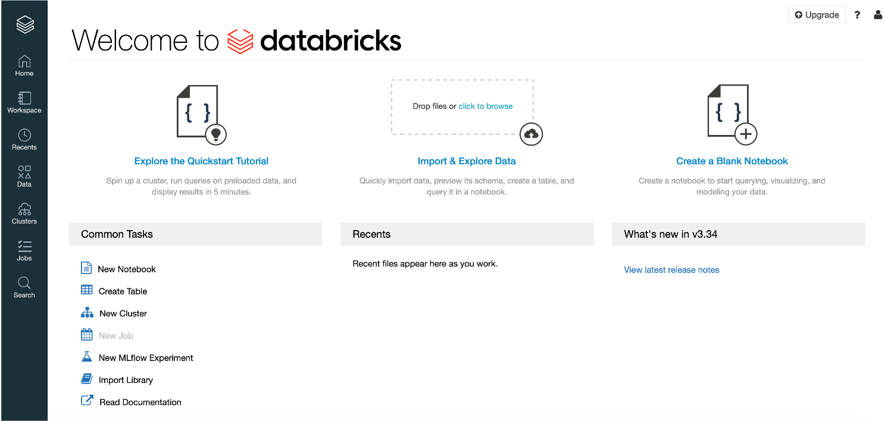

**ST446 Distributed Computing for Big Data**

Follow these steps to register for free at Databricks Community Edition, create clusters and run Python + Spark notebooks.

# Registration for Databricks Community Edition

Refer to the [Try Databricks page](https://databricks.com/try-databricks) and fill out your information. Then click on Get Started for Free. 

You will be able to register for a Community Edition license, which means you will have access to a single (one node) cluster with 15GB of RAM, 6GB of storage, Python, Spark and Scala.

# Databricks dashboard

Once you started your Community Edition, the dashboard allows you to create a new cluster, new notebook or a new table.

As a first experiment, choose **Explore the Quickstart Tutorial**. This will guide you through the process of creating a new cluster, attaching a notebook to it and
running some basic SQL commands.

## Creating a new cluster

The standard runtime version is 7.4 (Spark 3.0.1). Althought the list shows different runtime options (including GPUs), none of the Spark versions available are compatible with GPUs. Go ahead with the standard option.

The same applies to Regions. In this Community Edition license, only *us-west-2* is available.

Once your cluster is created and ready, it shows a green circle. **This process can take some minutes to complete as the Community Edition is a shared platform and there is only one region available.**

Go back to the tutorial to attach a simple notebook with some SQL commands over a test table (dataset).

## Creating a new table (dataset)

On the left panel, choose Data to Create a New Table. You can import data from your local machine, [Amazon S3 (Simple Storage Service)](https://aws.amazon.com/s3/) or [DBFS (Databricks File System)](https://docs.databricks.com/data/databricks-file-system.html).

For testing purposes, you can upload a simple TXT or CSV file into your dashboard. You may also choose which cluster should be used to create this new table. Then, you can choose between Create Table with UI or Create Table in Notebook.

The first option will allow you to preview and then create the new table.

The second option will provide a basic set of commands to create this new table inside your notebook.

## Further references

Databricks - [Get started with Apache Spark](https://docs.databricks.com/getting-started/spark/quick-start.html).

Databricks - [Apache Spark Tutorial](https://databricks.com/spark/getting-started-with-apache-spark).

Medium - [Spark in Databricks with Python and PySpark](https://medium.com/gowombat/a-simple-example-of-using-spark-in-databricks-with-python-and-pyspark-90c2754775b8).

There is a general documentation about Databricks [here](https://docs.databricks.com/).

