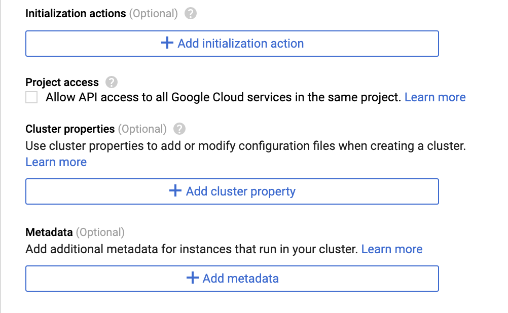
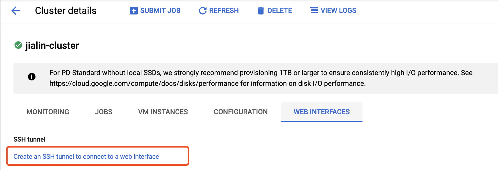
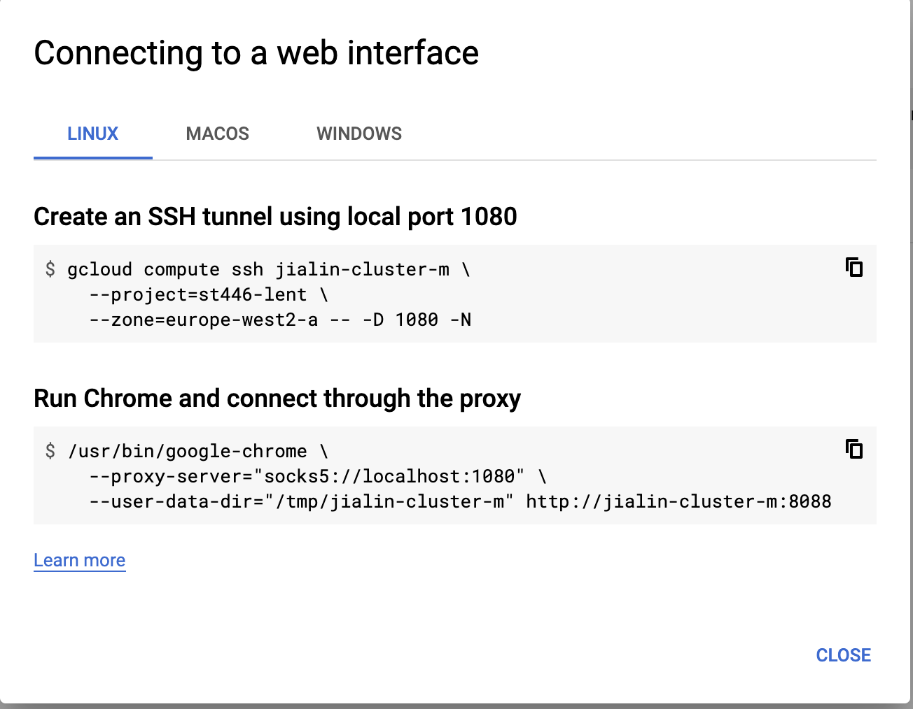
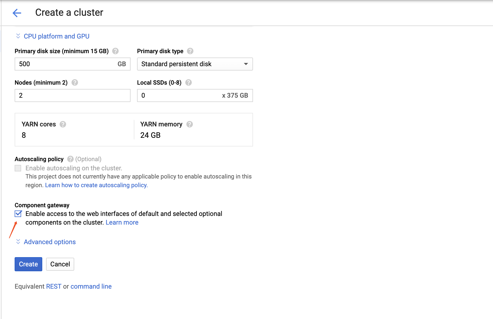

**ST446 Distributed Computing for Big Data - LT 2020-2021**

# Tutorial: Launching a jupyter/PySpark notebook on a GCP dataproc cluster

You will have to launch notebooks on dataproc clusters quite often (after week 2). As this process is somewhat cumbersome and confusing, this document is aimed at providing two ways to get a jupyter notebook web interface with cluster running as backend efficiently.

*Once you have understood this document and edited it in accordance with your preferences and setup, you should be able to merely copy all the commands below into a terminal window to get a new cluster with running jupyter/PySpark notebook.*

If you find a better way, or tricks for your operating system, please let [us](mailto:m.e.barreto@lse.ac.uk) know.

The methods in this document may not work due to updates in the Google Cloud Platform.

This tutorial requires you install a Chrome Web browser.

## Method 1. `ssh` connection

### Steps to set up google dataproc cluster:

1. Go to the [GCP console](https://console.cloud.google.com/)

2. Click at the menu button in the top left corner. Scroll down and click on "Dataproc" in the menu on the left.

3. You should see a "Create cluster" button in the centre of the screen after a while. Click on it.

4. Now you can configure the cluster. Enter a name (e.g. _jialin-cluster_), modify the zone to something like _europe-west2-a_ such that the physical computers used sit in London (ideally, this should reduce the latency). Also you can specify more detailed parameters like: memory, disk storage etc. (For most of use in this course, you don't need to change these)

5. Click on "Advanced Options" and add any buckets that you would like to include a specific cloud storage bucket.

6. Click on "+Add initialization action". In the text box that appears now, enter "gs://dataproc-initialization-actions/jupyter/jupyter.sh
".
This option automatically installs **jupyter** and some python libraries on all nodes of the dataproc cluster. You may also include `gs://dataproc-initialization-actions/python/pip-install.sh` (if you need to install some python packages, say `graphframe`), `gs://dataproc-initialization-actions/zookeeper/zookeeper.sh` and `gs://dataproc-initialization-actions/kafka/kafka.sh` (if you need to install `kafka`)



7. Observe that different python libraries are handed to the pip-install script through the metadata flag. Type `PIP_PACKAGES` as key and the python packages you want to install `sklearn nltk pandas graphframes` as the value

8. Scroll down and click the "Create" button and then wait.

9. If you prefer command lines, click on "command line" and copy and paste the shown command into your terminal or run them in Cloud Shell.
In my case, it looks something like this:
(Note that by default the clusters has on master machine _-m_ and two workers _-w-0_ and _-w-1_. They are separate machines.)

```
gcloud dataproc clusters create jialin-cluster --region europe-west2 --subnet default --zone europe-west2-c --master-machine-type n1-standard-4 --master-boot-disk-size 500 --num-workers 2 --worker-machine-type n1-standard-4 --worker-boot-disk-size 500 --image-version 1.3-deb9 --project st446-lent --initialization-actions 'gs://dataproc-initialization-actions/python/pip-install.sh','gs://dataproc-initialization-actions/zookeeper/zookeeper.sh','gs://dataproc-initialization-actions/kafka/kafka.sh' --metadata PIP_PACKAGES=sklearn nltk pandas graphframes
```

(This command can be useful to speed things up in the future: Once you have set it up in the right way, you can just use it whenever you need to set up a cluster with a notebook.)

### Steps to launch the jupyter notebook through your web browser:

1. If you now use the menu in the top left again and look at "Dataproc->Clusters", you will see that new virtual machines whose names correspond to the cluster name will have been created.

2. When the cluster is running, we need to set up an SSH tunnel to connect to the master node. Click on the cluster you created and then click on the "Web interfaces"



3. Click on "Create an SSH tunnel to connect to a web interface" choose accordinig to your operating system and then open TWO terminal windows and then
you will see the two blocks of code.



4. Change `8088` to `8123` and then run TWO blocks of code seperately and sequentially in TWO terminal windows. DON'T close any of the two terminal windows until you decide to delete the cluster.
This should open a new Chrome window and then you should now see the standard Jupyter notebook interface.


## Method 2. Google cloud's new feature: `component gateway`

### Steps to set up google dataproc cluster:

This is the way we use in seminar class 1.

Following steps 1-4 in Method 1,

* Tick the "Component gateway" and click on "Select component" in "Advanced options"




* Choose the "Anaconda" and "Jupyter" 

* Continue step 6-9 except that remove the `gs://dataproc-initialization-actions/jupyter/jupyter.sh` from the `initialization-actions` (otherwise this causes conflictions)

### Steps to launch the jupyter notebook through your web browser

"Dataproc->Clusters->Web interface->Jupyter"


## Jupyter notebooks running on master node

* To create a new notebook (in a new tab), click "New/PySpark" or "New/Python 3" in the top right.

* You can easily uploaded a notebook from your computer using the upload button. In this way, you can run the notebooks for the each week's class.

* To switch between Python 3 and PySpark in an existing notebook, click on Kernel/Change kernel/PySpark

* To explore the file system on master machine, go to New/Terminal. This gives you a Linux terminal on the remote machine in a new tab.

* Your edited notebooks are stored in the bucket connected with the cluster. To download your notebook, use gsutil, for example
```
gsutil cp gs://my-bucketname/notebooks/mynotebook.ipynb .
```

Have a look at this useful, yet slightly outdated [reference](https://towardsdatascience.com/data-science-for-startups-pyspark-1acf51e9d6ba).


